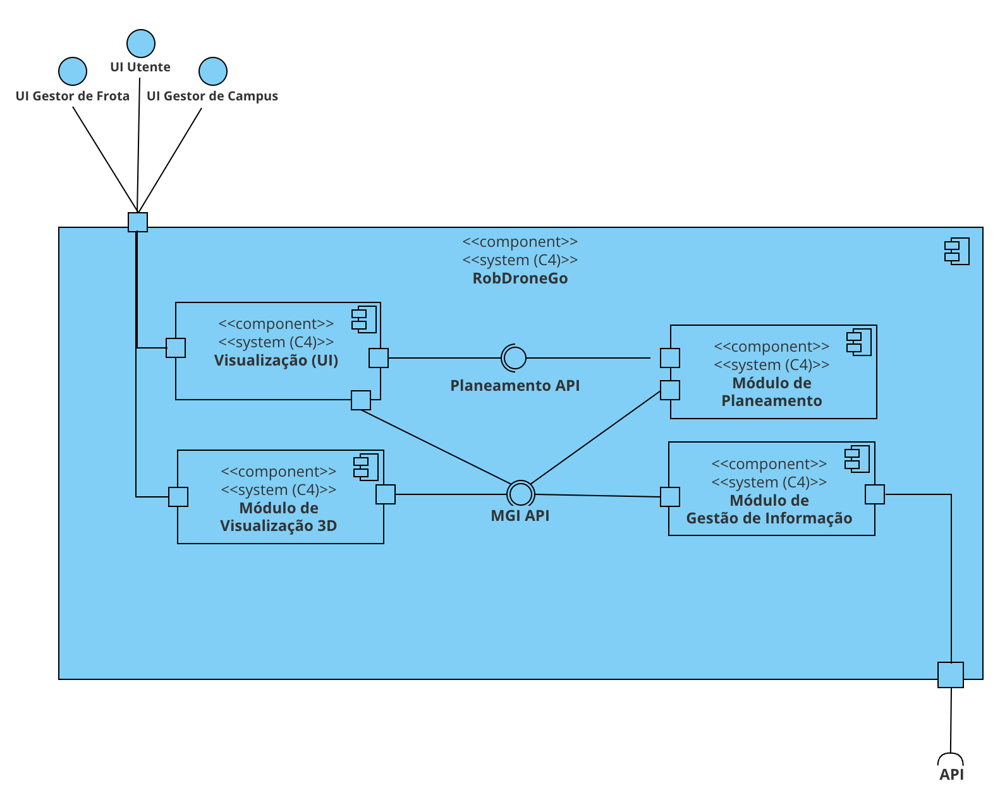

# Project Documentation

## Introduction

Vistas lógicas, de implementação e físicas de nivel 2 e 3.

## Vistas

### Nivel 2

#### O que deveria ser melhorado nesta vista

O componente HTTP Server e Módulo de Gestão de Informação deviam estar ligados.

#### O que deveria ser melhorado nesta vista

O módulo de visualização 3D faz parte do modúlo de visualização

#### O que deveria ser melhorado nesta vista

O módulo de visualização 3D faz parte do módulo de visualização.
O módulo de visualização não está ligado ao módulo de planeamento, só ao módulo de gestão de informação.

### Nivel 3

